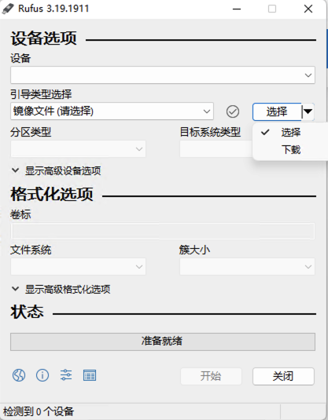
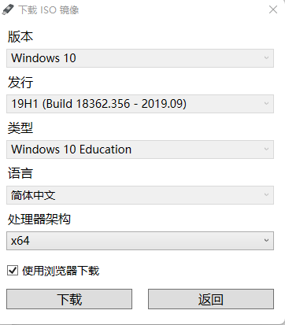

读书笔记

### 约定

不知道该怎么翻译的，我一律直接用英文原文，只可意会不可言传，自己悟去吧

## 第三章

我他妈直接从第三章开始读

在读这本书的时候我一共用到了三个镜像

windows 1903 x64

[windows 8.1 RTM x64]( https://archive.org/details/windows_8_professional_rtm)

[windows 8.1 RTM x86](https://archive.org/details/windows-8-pro-rtm-english-isos)

关于windows 1903 x64的下载，我使用的是[rufus](https://rufus.ie/en/)的下载功能，如下图所示

在书中，作者说，如果把逆向windows驱动的任务分成两部分，那么有90%的任务是理解Windows是怎么工作的，只有10%是阅读汇编代码

这一章的主要内容就是讲解Windows内核，而且是针对逆向的内核讲解

先讨论Windows内核的核心概念，以及与其关联的基础数据结构和与驱动编程相关的内核对象以及逆向

### 内存布局

